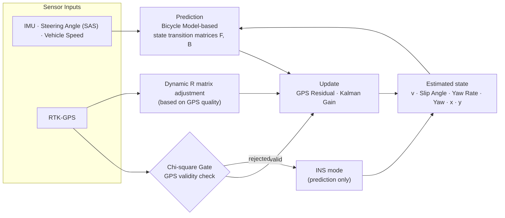



# 골프카트 자율주행 위치추정·제어 모듈

# Golf-Cart Autonomous Driving — Localization & Control Module

  {{ page.category_label }}
  {{ page.period }}
  
    {{ t }}
  

## 문제

자율주행 골프카트는 주행 내내 자신의 위치와 자세를 정확히 알아야 하지만, 실외 환경에서 GPS 수신 품질은 항상 보장되지 않음. RTK-GPS(cm급 정밀 측위)를 쓰더라도 품질이 저하된 구간의 측정값을 그대로 믿으면 위치 추정이 흔들리고, 그 오차가 조향 제어까지 그대로 전파. 품질이 변동하는 GPS를 다른 센서와 융합해 어떤 구간에서도 안정적으로 위치·자세를 추정하는 것이 이 프로젝트의 핵심 과제.

## 역할

LUXROBO의 골프카트 자율주행 모듈 개발 프로젝트에서 차량 위치 추정 및 주행 제어 모듈 개발 담당. 실차 주행 로그 기반 MATLAB 시뮬레이션으로 위치 추정 구조를 선행 설계·검증하고, 펌웨어와 비교할 수 있는 검증 환경 구축. 이후 모듈을 실차에 장착해 실제 골프장 환경에서 테스트 수행.

## 핵심 기여

### 위치 추정·센서 융합

- GPS·IMU·조향각(SAS)·차속 정보를 융합해, 자전거 모델(Bicycle Model) 기반 EKF(확장 칼만 필터)와 Chi-square Gate(통계적 이상치 판별)를 적용한 실시간 위치·자세 추정 모듈 설계·구현.
- 상태 벡터를 속도(v)·슬립각(Slip Angle)·요레이트(Yaw Rate)·요각(Yaw)·위치(x, y)로 정의하고, EKF 예측·보정 구조를 단계적으로 검증.
- GPS 측정값의 유효성을 Chi-square Gate로 판별하고, GPS 품질에 따라 측정 잡음 공분산(R 행렬)을 동적으로 조정하며 INS(관성항법)/GPS 모드를 전환하는 로직을 설계해 수신 품질 변동에 강인한 추정 구조 구축.

## Problem

An autonomous golf cart must know its own position and attitude accurately throughout driving, but GPS reception quality is never guaranteed in outdoor environments. Even with RTK-GPS (cm-level precision positioning), trusting measurements from quality-degraded segments as-is destabilizes the position estimate, and that error propagates directly into steering control. The core challenge of this project: fusing GPS of fluctuating quality with other sensors to estimate position and attitude reliably in every segment.

## Role

Responsible for developing the vehicle localization and driving control modules in LUXROBO's autonomous-driving module project for golf carts. Designed and validated the localization architecture in advance through MATLAB simulation based on real-vehicle driving logs, and built a validation environment comparable against the firmware. Then mounted the module on a real vehicle and conducted testing in an actual golf-course environment.

## Key Contributions

### Localization & Sensor Fusion

- Designed and implemented a real-time position/attitude estimation module fusing GPS, IMU, steering angle (SAS), and vehicle speed, applying a Bicycle Model-based EKF (Extended Kalman Filter) with a Chi-square Gate (statistical outlier rejection).
- Defined the state vector as velocity (v), Slip Angle, Yaw Rate, Yaw, and position (x, y), and progressively validated the EKF prediction/correction structure.
- Designed logic that determines GPS measurement validity with a Chi-square Gate, dynamically adjusts the measurement noise covariance (R matrix) based on GPS quality, and switches between INS (inertial navigation)/GPS modes — building an estimation structure robust to fluctuating reception quality.

_실시간 EKF 아키텍처 — 다이어그램은 non-production data 기반 재구성_

### 조향 제어·경로 계획

- RTK-GPS 기반 고정밀 위치 추정 결과를 입력으로, Pure Pursuit 기반 조향 제어와 주행 경로 계획 알고리즘 개발.

### 검증·병목 분석

- 실차 주행 로그(.bin)를 재생하는 MATLAB 오프라인 시뮬레이션 환경을 선행 구축해, 실차 투입 전에 추정 알고리즘을 반복 검증.
- 시뮬레이션과 펌웨어 간 위치 추정 결과를 비교하는 실시간 주행 로그 재생 환경을 구축해, 구현 일치성을 비교·검증할 수 있는 기반 마련.
- 펌웨어 내부 TASK 우선순위와 실행 성능을 분석해 시스템 병목 진단.

_MATLAB 기반 센서 데이터 시뮬레이션 예시 — 추정 궤적·속도·Yaw·GPS 품질(HDOP/Age)·자이로·공분산 수렴 (시뮬레이션 데이터)_

## 결과

자전거 모델 기반 EKF 예측·보정 구조를 MATLAB 시뮬레이션에서 단계적으로 검증하고, 시뮬레이션과 펌웨어 간 위치 추정 결과를 비교하는 실시간 주행 로그 재생 환경 구축. 이후 모듈을 실차에 장착해 실제 골프장 환경에서 테스트 수행.

---

[← 모든 프로젝트 보기](/projects/){: .project-nav-link } · [CV 보기](/cv/){: .project-nav-link }

_Real-time EKF architecture — diagram reconstructed from non-production data_

### Steering Control & Path Planning

- Developed Pure Pursuit-based steering control and driving path planning algorithms, taking the RTK-GPS-based high-precision localization output as input.

### Validation & Bottleneck Analysis

- Built an offline MATLAB simulation environment replaying real-vehicle driving logs (.bin) ahead of real-vehicle testing, enabling repeated validation of the estimation algorithm before deployment.
- Built a real-time driving-log replay environment comparing localization results between simulation and firmware, laying the groundwork for verifying implementation consistency.
- Analyzed firmware TASK priorities and execution performance to diagnose system bottlenecks.

_Example of MATLAB-based sensor data simulation — estimated trajectory, velocity, Yaw, GPS quality (HDOP/Age), gyro, covariance convergence (simulation data)_

## Results

Progressively validated the Bicycle Model-based EKF prediction/correction structure in MATLAB simulation, and built a real-time driving-log replay environment comparing localization results between simulation and firmware. Then mounted the module on a real vehicle and conducted testing in an actual golf-course environment.

---

[← All Projects](/projects/){: .project-nav-link } · [View CV](/cv/){: .project-nav-link }

