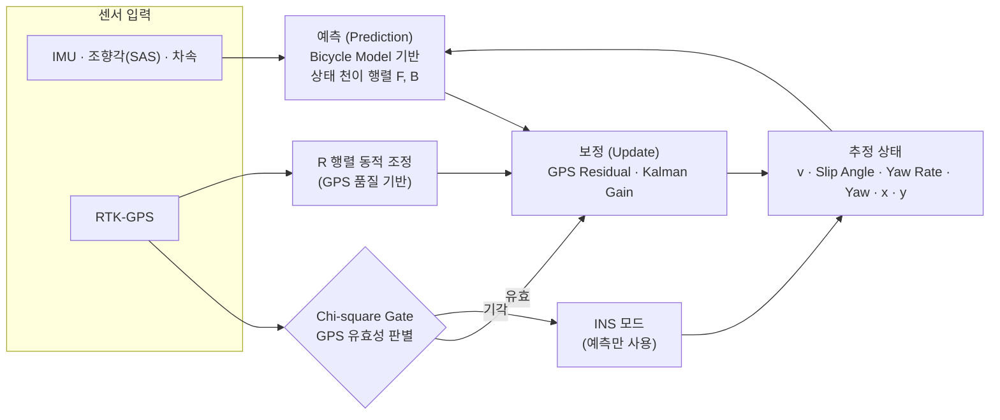

  {{ page.category_label }}
  {{ page.period }}
  
    {{ t }}
  

## 문제

자율주행 골프카트는 주행 내내 자신의 위치와 자세를 정확히 알아야 하지만, 실외 환경에서 GPS 수신 품질은 항상 보장되지 않는다. RTK-GPS(cm급 정밀 측위)를 쓰더라도 품질이 저하된 구간의 측정값을 그대로 믿으면 위치 추정이 흔들리고, 그 오차가 조향 제어까지 그대로 전파된다. 품질이 변동하는 GPS를 다른 센서와 융합해 어떤 구간에서도 안정적으로 위치·자세를 추정하는 것이 이 프로젝트의 핵심 과제였다.

## 역할

LUXROBO의 골프카트 자율주행 모듈 개발 프로젝트에서 차량 위치 추정 및 주행 제어 모듈 개발을 담당했다. 실차 주행 로그 기반 MATLAB 시뮬레이션으로 위치 추정 구조를 선행 설계·검증하고, 펌웨어와 비교할 수 있는 검증 환경을 구축했으며, 모듈을 실차에 장착해 실제 골프장 환경에서 테스트를 수행했다.

## 핵심 기여

### 위치 추정·센서 융합

- GPS·IMU·조향각(SAS)·차속 정보를 융합해, 자전거 모델(Bicycle Model) 기반 EKF(확장 칼만 필터)와 Chi-square Gate(통계적 이상치 판별)를 적용한 실시간 위치·자세 추정 모듈을 설계·구현했다.
- 상태 벡터를 속도(v)·슬립각(Slip Angle)·요레이트(Yaw Rate)·요각(Yaw)·위치(x, y)로 정의하고, EKF 예측·보정 구조를 단계적으로 검증했다.
- GPS 측정값의 유효성을 Chi-square Gate로 판별하고, GPS 품질에 따라 측정 잡음 공분산(R 행렬)을 동적으로 조정하며 INS(관성항법)/GPS 모드를 전환하는 로직을 설계해 수신 품질 변동에 강인한 추정 구조를 만들었다.

_실시간 EKF 아키텍처 — 다이어그램은 non-production data 기반 재구성_

### 조향 제어·경로 계획

- RTK-GPS 기반 고정밀 위치 추정 결과를 입력으로, Pure Pursuit 기반 조향 제어와 주행 경로 계획 알고리즘을 개발했다.

### 검증·병목 분석

- 실차 주행 로그(.bin)를 재생하는 MATLAB 오프라인 시뮬레이션 환경을 선행 구축해, 실차 투입 전에 추정 알고리즘을 반복 검증했다.
- 시뮬레이션과 펌웨어 간 위치 추정 결과를 비교하는 실시간 주행 로그 재생 환경을 구축해, 구현 일치성을 비교·검증할 수 있는 기반을 마련했다.
- 펌웨어 내부 TASK 우선순위와 실행 성능을 분석해 시스템 병목을 진단했다.

_MATLAB 기반 센서 데이터 시뮬레이션 예시 — 추정 궤적·속도·Yaw·GPS 품질(HDOP/Age)·자이로·공분산 수렴 (시뮬레이션 데이터)_

## 결과

자전거 모델 기반 EKF 예측·보정 구조를 MATLAB 시뮬레이션에서 단계적으로 검증했고, 시뮬레이션과 펌웨어 간 위치 추정 결과를 비교하는 실시간 주행 로그 재생 환경을 구축했다. 이후 모듈을 실차에 장착해 실제 골프장 환경에서 테스트를 수행했다.

---

[← 모든 프로젝트 보기](/projects/){: .project-nav-link } · [CV 보기](/cv/){: .project-nav-link }
