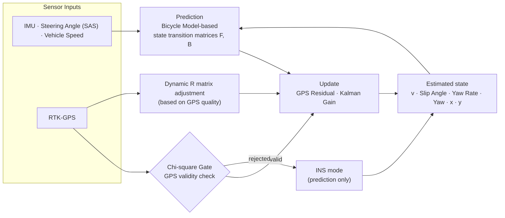



# 골프카트 자율주행 위치추정·제어 모듈

# Golf-Cart Autonomous Driving — Localization & Control Module

  {{ page.category_label }}
  {{ page.period }}
  
    {{ t }}
  

GPS 품질이 흔들려도 위치 추정이 버티게 만드는 일이었다. 자전거 모델 기반 EKF에 Chi-square Gate와 측정 잡음 동적 조정을 더한 추정 모듈을 설계했고, 실차 주행 로그를 재생하는 MATLAB 환경에서 검증한 뒤 실차에 실어 골프장에서 테스트했다.

## 문제

자율주행 골프카트는 주행 내내 자기 위치와 자세를 알아야 한다. 그런데 실외에서 GPS 수신 품질은 보장되지 않는다. RTK-GPS(cm급 정밀 측위)를 쓰더라도 품질이 무너진 구간의 측정값을 그대로 믿으면 위치 추정이 흔들리고, 그 오차는 조향 제어까지 번진다. 품질이 변하는 GPS를 다른 센서와 융합해 어떤 구간에서도 추정이 버티게 만드는 것이 핵심 과제였다.

## 역할

LUXROBO의 골프카트 자율주행 모듈 프로젝트에서 차량 위치 추정과 주행 제어 모듈을 맡았다. 실차 주행 로그를 재생하는 MATLAB 시뮬레이션으로 추정 구조를 먼저 설계·검증했고, 펌웨어 구현과 결과를 맞대볼 수 있는 검증 환경도 만들었다.

## 핵심 기여

### 위치 추정·센서 융합

- GPS·IMU·조향각(SAS)·차속 정보를 융합해, 자전거 모델(Bicycle Model) 기반 EKF(확장 칼만 필터)와 Chi-square Gate(통계적 이상치 판별)를 적용한 실시간 위치·자세 추정 모듈 설계·구현.
- 상태 벡터를 속도(v)·슬립각(Slip Angle)·요레이트(Yaw Rate)·요각(Yaw)·위치(x, y)로 정의하고, EKF 예측·보정 구조를 단계적으로 검증.
- GPS 측정값의 유효성을 Chi-square Gate로 판별하고, GPS 품질에 따라 측정 잡음 공분산(R 행렬)을 동적으로 조정하며 INS(관성항법)/GPS 모드를 전환하는 로직 설계.

The goal was localization that stays steady when GPS quality wobbles. I designed an estimation module around a Bicycle Model EKF with a Chi-square gate and dynamic measurement-noise adjustment, validated it in a MATLAB environment replaying real driving logs, then tested it on a real cart on a golf course.

## Problem

An autonomous golf cart has to know its position and attitude at every moment, but outdoor GPS reception never comes with a guarantee. Even with RTK-GPS (cm-level positioning), trusting measurements from a degraded stretch destabilizes the estimate, and that error feeds straight into steering. The core challenge was fusing fluctuating-quality GPS with other sensors so the estimate holds up in every stretch.

## Role

I owned the vehicle localization and driving-control modules in LUXROBO's golf-cart autonomous-driving project. I designed and validated the localization architecture up front in MATLAB simulation based on real driving logs, and built a validation environment where the simulation can be compared against the firmware. The module then went onto a real vehicle for testing on an actual golf course.

## Key Contributions

### Localization & Sensor Fusion

- Designed and implemented a real-time position/attitude estimation module fusing GPS, IMU, steering angle (SAS), and vehicle speed, applying a Bicycle Model-based EKF (Extended Kalman Filter) with a Chi-square Gate (statistical outlier rejection).
- Defined the state vector as velocity (v), Slip Angle, Yaw Rate, Yaw, and position (x, y), and progressively validated the EKF prediction/correction structure.
- Designed logic that checks GPS validity with a Chi-square gate, adjusts the measurement noise covariance (R matrix) to the current GPS quality, and switches between INS (inertial navigation) and GPS modes as reception degrades.

```mermaid
flowchart LR
  subgraph IN["Sensor Inputs"]
    S1["IMU · Steering Angle (SAS) · Vehicle Speed"]
    S2["RTK-GPS"]
  end
  P["Prediction<br>Bicycle Model-based<br>state transition matrices F, B"]
  G{"Chi-square Gate<br>GPS validity check"}
  R["Dynamic R matrix adjustment<br>(based on GPS quality)"]
  U["Update<br>GPS Residual · Kalman Gain"]
  I["INS mode<br>(prediction only)"]
  X["Estimated state<br>v · Slip Angle · Yaw Rate · Yaw · x · y"]
  S1 --> P
  S2 --> G
  S2 --> R
  G -->|valid| U
  G -->|rejected| I
  R --> U
  P --> U
  U --> X
  I --> X
  X --> P
```

_실시간 EKF 아키텍처 (다이어그램은 non-production data 기반 재구성)_

### 조향 제어·경로 계획

- RTK-GPS 기반 고정밀 위치 추정 결과를 입력으로, Pure Pursuit 기반 조향 제어와 주행 경로 계획 알고리즘 개발.

### 검증·병목 분석

- 실차 주행 로그(.bin)를 재생하는 MATLAB 오프라인 시뮬레이션 환경을 선행 구축해, 실차 투입 전에 추정 알고리즘을 반복 검증.
- 같은 주행 로그를 시뮬레이션과 펌웨어에 나란히 재생해 위치 추정 결과를 비교하는 환경 구축.
- 펌웨어 내부 TASK 우선순위와 실행 성능을 분석해 시스템 병목 진단.

_MATLAB 기반 센서 데이터 시뮬레이션 예시: 추정 궤적·속도·Yaw·GPS 품질(HDOP/Age)·자이로·공분산 수렴 (시뮬레이션 데이터)_

## 결과

자전거 모델 기반 EKF 예측·보정 구조를 MATLAB 시뮬레이션에서 단계적으로 검증했다. 같은 주행 로그를 시뮬레이션과 펌웨어에 나란히 재생해 추정 결과를 비교할 수 있게 만들어, 구현이 설계와 일치하는지 확인하는 기반을 갖췄다. 이후 모듈을 실차에 장착해 실제 골프장에서 테스트를 진행했다.

---

[← 모든 프로젝트 보기](/projects/){: .project-nav-link } · [CV 보기](/cv/){: .project-nav-link }

_Real-time EKF architecture — diagram reconstructed from non-production data_

### Steering Control & Path Planning

- Developed Pure Pursuit-based steering control and driving path planning algorithms, taking the RTK-GPS-based high-precision localization output as input.

### Validation & Bottleneck Analysis

- Built an offline MATLAB simulation environment that replays real-vehicle driving logs (.bin), so the estimation algorithm could be validated repeatedly before ever touching the vehicle.
- Built a replay environment that runs the same driving log through both the simulation and the firmware and compares their localization results.
- Analyzed firmware TASK priorities and execution performance to diagnose system bottlenecks.

_Example of MATLAB-based sensor data simulation — estimated trajectory, velocity, Yaw, GPS quality (HDOP/Age), gyro, covariance convergence (simulation data)_

## Results

I validated the Bicycle Model EKF prediction/correction structure step by step in MATLAB simulation. The replay environment runs the same driving log through both the simulation and the firmware, which gives a concrete way to check that the implementation matches the design. The module was then mounted on a real cart and tested on an actual golf course.

---

[← All Projects](/projects/){: .project-nav-link } · [View CV](/cv/){: .project-nav-link }

