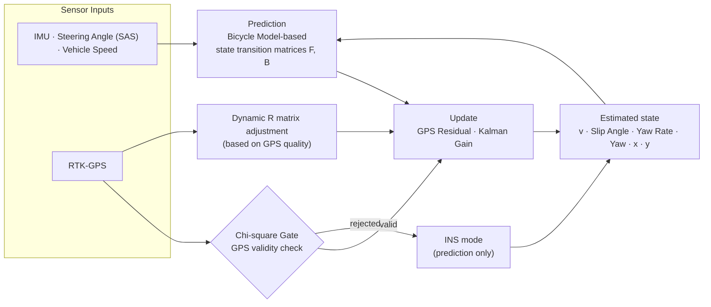



# 골프카트 자율주행 위치추정·제어 모듈

# Golf-Cart Autonomous Driving — Localization & Control Module

  {{ page.category_label }}
  {{ page.period }}
  
    {{ t }}
  

GPS 품질 저하 구간에서도 위치 추정을 유지하기 위해 자전거 모델 기반 EKF에 측정 유효성 판단과 잡음 동적 조정을 결합. 실차 로그 재생 환경에서 설계와 펌웨어 구현을 대조한 뒤 실제 골프장에서 테스트.

  
담당<strong>위치 추정 · 주행 제어</strong>

  
구조<strong>Bicycle Model EKF · Pure Pursuit</strong>

  
검증<strong>로그 재생 · 펌웨어 · 실차</strong>

## 문제

자율주행 골프카트의 위치와 자세를 안정적으로 유지하려면 GPS 품질 저하 구간에 대한 대응이 필요. RTK-GPS(cm급 정밀 측위)를 사용하더라도 품질이 무너진 구간의 측정값을 그대로 반영하면 위치 오차가 커지고 조향 제어까지 영향을 받는 문제.

## 역할

LUXROBO의 골프카트 자율주행 모듈 프로젝트에서 차량 위치 추정과 주행 제어 모듈 담당. 실차 주행 로그를 재생하는 MATLAB 시뮬레이션으로 추정 구조를 먼저 설계·검증한 뒤, 펌웨어 구현 결과와 맞대볼 수 있는 검증 환경까지 구성.

## 위치 추정 구조

- 자전거 모델(Bicycle Model) 기반 EKF(확장 칼만 필터)를 뼈대로, GPS·IMU·조향각(SAS)·차속 정보를 융합한 실시간 위치·자세 추정 모듈 설계·구현.
- 상태 벡터는 속도(v)·슬립각(Slip Angle)·요레이트(Yaw Rate)·요각(Yaw)·위치(x, y)로 정의. 예측·보정 구조는 단계적으로 검증.

## GPS 품질 대응

- Chi-square Gate(통계적 이상치 판별)를 이용한 GPS 측정값 유효성 판별.
- 수신 품질에 따른 측정 잡음 공분산(R 행렬) 조정과 INS/GPS 모드 전환 로직 설계.

To keep localization stable through GPS-quality degradation, I combined a Bicycle Model EKF with measurement-validity screening and dynamic noise adjustment. I compared the design against firmware in a real-log replay environment before testing the module on a golf course.

  
Scope<strong>Localization · Driving Control</strong>

  
Architecture<strong>Bicycle Model EKF · Pure Pursuit</strong>

  
Validation<strong>Log Replay · Firmware · Real Vehicle</strong>

## Problem

An autonomous golf cart needs a stable position and attitude estimate throughout a drive. Even with RTK-GPS (cm-level positioning), degraded measurements can increase localization error and feed that error directly into steering control.

## Role

I owned the vehicle localization and driving-control modules in LUXROBO's golf-cart autonomous-driving project. I designed and validated the localization architecture up front in MATLAB simulation based on real driving logs, and built a validation environment where the simulation can be compared against the firmware.

## Localization Architecture

- Designed and implemented a real-time position/attitude estimation module built on a Bicycle Model EKF (Extended Kalman Filter) that fuses GPS, IMU, steering angle (SAS), and vehicle speed.
- Defined the state vector as velocity (v), Slip Angle, Yaw Rate, Yaw, and position (x, y), then validated the prediction/correction structure step by step.

## GPS Quality Handling

- Screened GPS measurements with a Chi-square Gate for statistical outlier rejection.
- Adjusted the measurement noise covariance (R matrix) with GPS quality and switched between INS and GPS modes as reception changed.

```mermaid
flowchart LR
  subgraph IN["Sensor Inputs"]
    S1["IMU · Steering Angle (SAS) · Vehicle Speed"]
    S2["RTK-GPS"]
  end
  P["Prediction<br>Bicycle Model-based<br>state transition matrices F, B"]
  G{"Chi-square Gate<br>GPS validity check"}
  R["Dynamic R matrix adjustment<br>(based on GPS quality)"]
  U["Update<br>GPS Residual · Kalman Gain"]
  I["INS mode<br>(prediction only)"]
  X["Estimated state<br>v · Slip Angle · Yaw Rate · Yaw · x · y"]
  S1 --> P
  S2 --> G
  S2 --> R
  G -->|valid| U
  G -->|rejected| I
  R --> U
  P --> U
  U --> X
  I --> X
  X --> P
```

_실시간 EKF 아키텍처 (다이어그램은 non-production data 기반 재구성)_

## 조향 제어와 경로 생성

- RTK-GPS 기반 고정밀 위치 추정 결과를 입력으로 받는 Pure Pursuit 조향 제어 알고리즘 개발.
- 동일한 추정 결과 위에서 동작하는 주행 경로 계획 알고리즘 개발.

## 시뮬레이션·펌웨어 검증

- 실차 주행 로그(.bin)를 재생하는 MATLAB 오프라인 시뮬레이션 환경 선행 구축. 실차 투입 전 추정 알고리즘 반복 검증.
- 같은 주행 로그를 시뮬레이션과 펌웨어에 나란히 재생해 위치 추정 결과를 비교하는 환경 마련.
- 펌웨어 내부 TASK 우선순위와 실행 성능 분석을 통한 시스템 병목 진단.

_MATLAB 기반 센서 데이터 시뮬레이션 예시: 추정 궤적·속도·Yaw·GPS 품질(HDOP/Age)·자이로·공분산 수렴 (시뮬레이션 데이터)_

자전거 모델 기반 EKF 예측·보정 구조는 MATLAB 시뮬레이션에서 단계적으로 검증. 같은 주행 로그를 시뮬레이션과 펌웨어에 나란히 재생하는 방식으로, 구현이 설계와 일치하는지 상시 대조 가능.

## 실차 테스트

이후 모듈을 실차에 장착해 실제 골프장에서 테스트 진행.

---

[← 모든 프로젝트 보기](/projects/){: .project-nav-link } · [CV 보기](/cv/){: .project-nav-link }

_Real-time EKF architecture — diagram reconstructed from non-production data_

## Steering Control & Path Generation

- Developed a Pure Pursuit steering controller that takes the RTK-GPS-based high-precision localization output as its input.
- Developed the driving path planning algorithm that runs on the same estimation output.

## Simulation & Firmware Validation

- Built an offline MATLAB simulation environment that replays real-vehicle driving logs (.bin). The estimation algorithm was validated repeatedly there before it ever touched the vehicle.
- Built a replay environment that runs the same driving log through both the simulation and the firmware and compares their localization results.
- Analyzed firmware TASK priorities and execution performance to diagnose system bottlenecks.

_Example of MATLAB-based sensor data simulation — estimated trajectory, velocity, Yaw, GPS quality (HDOP/Age), gyro, covariance convergence (simulation data)_

I validated the Bicycle Model EKF prediction/correction structure step by step in MATLAB simulation. The replay environment runs the same driving log through both the simulation and the firmware, which gives a concrete way to check that the implementation matches the design.

## Real-Vehicle Testing

The module was then mounted on a real cart and tested on an actual golf course.

---

[← All Projects](/projects/){: .project-nav-link } · [View CV](/cv/){: .project-nav-link }

