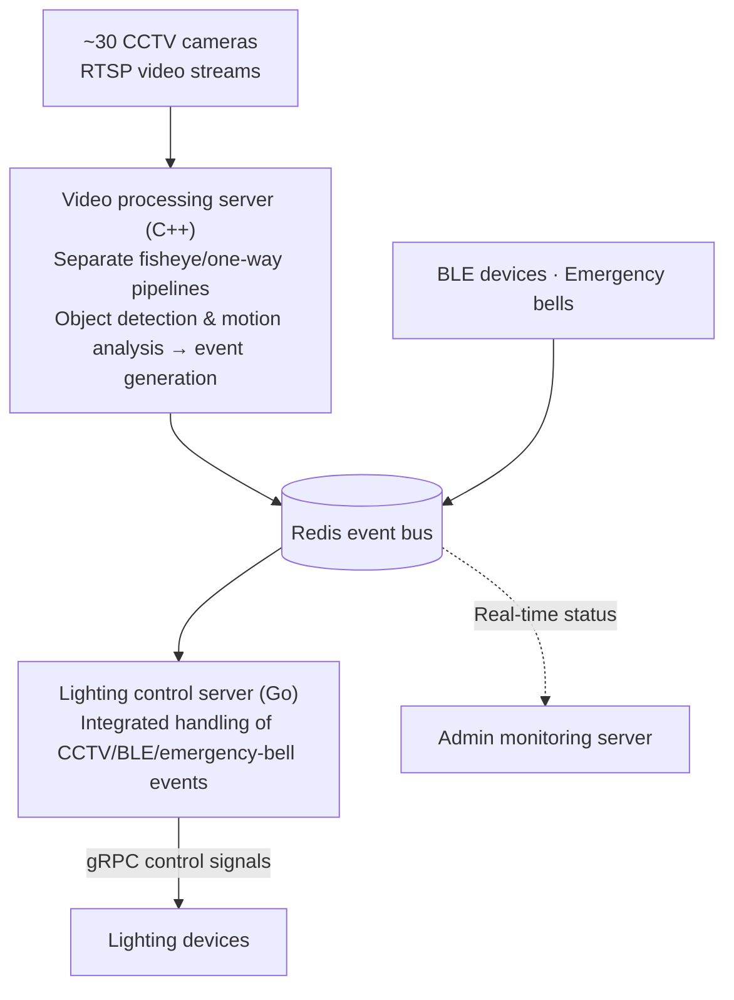



  {{ page.category_label }}
  {{ page.period }}
  
    {{ t }}
  

# 스마트 주차 시스템 — 단일 서버 약 30대 CCTV 영상처리·조명제어

## 개요

영상 인지(Optical Flow·YOLO) 결과를 서버 이벤트로 변환해, Redis·gRPC 기반 실시간 조명 제어까지 연계한 스마트 주차 통합 시스템. 카메라가 상황을 인지하면 그 결과가 이벤트로 흘러 조명 제어로 이어지는 인지→이벤트→제어 흐름을 갖추고 있으며, 이 중 두 축인 영상 처리 서버와 조명 제어 서버 개발 담당.

## 문제

주차장 전역에 설치된 약 30대의 CCTV가 보내오는 RTSP 영상 스트림을 단일 서버에서 동시에 수신·분석 필요. 카메라 수가 늘수록 디코딩과 분석 부하가 함께 늘어나는 데다, 어안(Fisheye) 카메라와 단방향(One-way) 카메라는 요구되는 분석이 서로 달라 하나의 파이프라인으로 묶기 어려움. 여기에 영상 인지 결과뿐 아니라 BLE(저전력 블루투스) 장치·비상벨 등 서로 다른 소스의 이벤트를 통합해, 상황 인지 기반의 조명 제어까지 끊김 없이 연결 필요.

## 역할

LUXROBO에서 시스템의 두 축인 영상 처리 서버(C++)와 조명 제어 서버(Go) 개발 담당. 영상 인지에서 이벤트 생성까지, 그리고 이벤트 수신에서 조명 장치 제어까지의 서버 파이프라인이 담당 범위.

## 시스템 구성

아래는 시스템의 이벤트 흐름을 도식화한 구성도.

# Smart Parking System — ~30 CCTV Video Processing & Lighting Control on a Single Server

## Overview

An integrated smart parking system that converts video perception results (Optical Flow, YOLO) into server events and links them to real-time lighting control over Redis and gRPC. When a camera perceives a situation, the result flows as an event and drives the lighting — a perception → event → control pipeline. Developed the system's two core servers: the video processing server and the lighting control server.

## Problem

RTSP video streams from about 30 CCTV cameras installed across the parking facility had to be received and analyzed simultaneously on a single server. Decoding and analysis load grows with every added camera, and fisheye and one-way cameras require different kinds of analysis, making a single unified pipeline impractical. On top of that, events from heterogeneous sources — not only video perception results but also BLE (Bluetooth Low Energy) devices and emergency bells — had to be integrated and connected seamlessly to situation-aware lighting control.

## Role

Responsible at LUXROBO for developing the system's two core servers: the video processing server (C++) and the lighting control server (Go). Scope covered the server pipeline from video perception to event generation, and from event reception to lighting device control.

## System Architecture

The diagram below illustrates the event flow of the system.

## 핵심 기여

**영상 처리 서버 (C++)**

- RTSP 스트림 수신부터 분석까지를 어안/단방향 카메라 파이프라인으로 분리해, 단일 서버에서 전체 카메라를 동시에 제어·분석하면서도 유형별로 확장 가능한 구조로 설계.
- Optical Flow(움직임 기반 감지)로 객체의 움직임·방향·속도를 실시간 분석하고, YOLOv7(ONNX) 객체 탐지를 CUDA 가속으로 수행해 차량·보행자 등 주차 관련 객체 인식.
- 분석 결과를 서버 이벤트로 변환해 Redis와 gRPC로 전달, 조명 제어와 관리자 모니터링 시스템에 연동.

**조명 제어 서버 (Go)**

- 영상 처리 서버와 BLE 장치에서 발생하는 이벤트를 실시간 수신·관리하는 Redis 기반 이벤트 처리 구조 설계.
- 호출 시 RSSI(무선 신호 세기) 비교로 가장 근접한 카메라를 자동 식별하는 로직 구현.
- CCTV·BLE·비상벨 이벤트를 통합 처리해, gRPC 통신으로 다양한 종류의 조명등을 상황에 따라 동적으로 제어.

## 결과

시스템은 2025년 5월 납품 완료. 단일 영상 처리 서버에서 약 30대 규모의 카메라를 동시에 제어·분석하는 구조를 구축하고, 카메라 유형별(어안/단방향) 파이프라인 분리 설계로 확장성과 안정성 확보. 영상 인지 결과가 Redis 이벤트를 거쳐 gRPC 기반 조명 제어로 이어지는 인지→이벤트→제어 전 과정을 두 서버로 구현해 스마트 주차 통합 시스템 완성.

---

[← 모든 프로젝트 보기](/projects/){: .project-nav-link } · [CV 보기](/cv/){: .project-nav-link }

## Key Contributions

**Video Processing Server (C++)**

- Separated the pipeline from RTSP stream reception to analysis into fisheye/one-way camera pipelines, controlling and analyzing all cameras simultaneously on a single server while keeping the structure extensible per camera type.
- Analyzed object motion, direction, and speed in real time with Optical Flow (motion-based detection), and detected parking-related objects such as vehicles and pedestrians using CUDA-accelerated YOLOv7 (ONNX).
- Converted analysis results into server events and delivered them over Redis and gRPC, integrating with the lighting control and admin monitoring systems.

**Lighting Control Server (Go)**

- Designed a Redis-based event processing structure that receives and manages events from the video processing server and BLE devices in real time.
- Implemented logic that automatically identifies the nearest camera via RSSI (radio signal strength) comparison when a call is triggered.
- Handled CCTV, BLE, and emergency-bell events in an integrated manner, dynamically controlling various types of lighting devices over gRPC according to the situation.

## Results

The system was delivered in May 2025. Built a structure in which a single video processing server simultaneously controls and analyzes about 30 cameras, with the per-type (fisheye/one-way) pipeline separation securing scalability and stability. Implemented the full perception → event → control chain — video perception results flowing through Redis events into gRPC-based lighting control — across the two servers, completing the integrated smart parking system.

---

[← All Projects](/projects/){: .project-nav-link } · [View CV](/cv/){: .project-nav-link }

