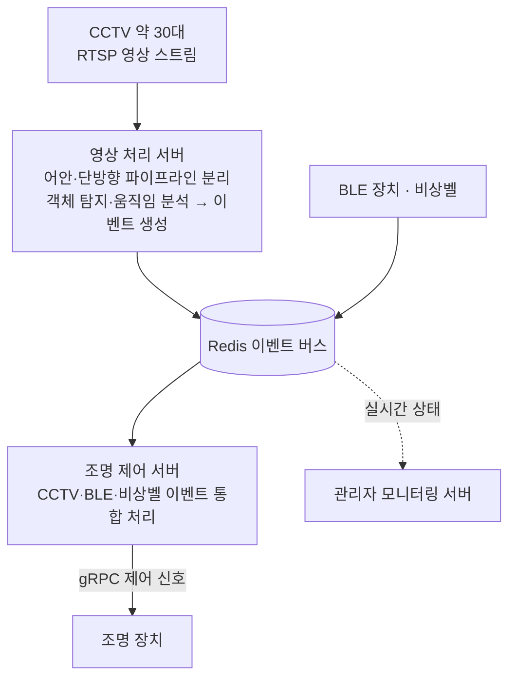

  {{ page.category_label }}
  {{ page.period }}
  
    {{ t }}
  

## 개요

영상 인지(Optical Flow·YOLO) 결과를 서버 이벤트로 변환해, Redis·gRPC 기반 실시간 조명 제어까지 연계한 스마트 주차 통합 시스템이다. 카메라가 상황을 인지하면 그 결과가 이벤트로 흘러 조명 제어로 이어지는 인지→이벤트→제어 흐름을 갖추고 있으며, 이 중 두 축인 영상 처리 서버와 조명 제어 서버 개발을 담당했다.

## 문제

주차장 전역에 설치된 약 30대의 CCTV가 보내오는 RTSP 영상 스트림을 단일 서버에서 동시에 수신·분석해야 했다. 카메라 수가 늘수록 디코딩과 분석 부하가 함께 늘어나는 데다, 어안(Fisheye) 카메라와 단방향(One-way) 카메라는 요구되는 분석이 서로 달라 하나의 파이프라인으로 묶기 어렵다. 여기에 영상 인지 결과뿐 아니라 BLE(저전력 블루투스) 장치·비상벨 등 서로 다른 소스의 이벤트를 통합해, 상황 인지 기반의 조명 제어까지 끊김 없이 이어지게 만들어야 했다.

## 역할

LUXROBO에서 시스템의 두 축인 영상 처리 서버와 조명 제어 서버 개발을 담당했다. 영상 인지에서 이벤트 생성까지, 그리고 이벤트 수신에서 조명 장치 제어까지의 서버 파이프라인이 담당 범위였다.

## 시스템 구성

아래는 시스템의 이벤트 흐름을 도식화한 구성도다.

## 핵심 기여

**영상 처리 서버**

- RTSP 스트림 수신부터 분석까지를 어안/단방향 카메라 파이프라인으로 분리해, 단일 서버에서 전체 카메라를 동시에 제어·분석하면서도 유형별로 확장 가능한 구조로 설계했다.
- Optical Flow(움직임 기반 감지)로 객체의 움직임·방향·속도를 실시간 분석하고, YOLOv7(ONNX) 객체 탐지를 CUDA 가속으로 수행해 차량·보행자 등 주차 관련 객체를 인식했다.
- 분석 결과를 서버 이벤트로 변환해 Redis와 gRPC로 전달, 조명 제어와 관리자 모니터링 시스템에 연동했다.

**조명 제어 서버**

- 영상 처리 서버와 BLE 장치에서 발생하는 이벤트를 실시간 수신·관리하는 Redis 기반 이벤트 처리 구조를 설계했다.
- 호출 시 RSSI(무선 신호 세기) 비교로 가장 근접한 카메라를 자동 식별하는 로직을 구현했다.
- CCTV·BLE·비상벨 이벤트를 통합 처리해, gRPC 통신으로 다양한 종류의 조명등을 상황에 따라 동적으로 제어했다.

## 결과

시스템은 2025년 5월 납품 완료됐다. 단일 영상 처리 서버에서 약 30대 규모의 카메라를 동시에 제어·분석하는 구조를 구축했고, 카메라 유형별(어안/단방향) 파이프라인 분리 설계로 확장성과 안정성을 확보했다. 영상 인지 결과가 Redis 이벤트를 거쳐 gRPC 기반 조명 제어로 이어지는 인지→이벤트→제어 전 과정을 두 서버로 구현해 스마트 주차 통합 시스템을 완성했다.

---

[← 모든 프로젝트 보기](/projects/){: .project-nav-link } · [CV 보기](/cv/){: .project-nav-link }
