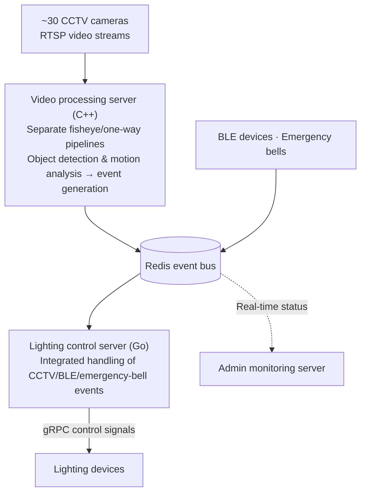



# 스마트 주차 시스템 — 단일 서버 약 30대 CCTV 영상처리·조명제어

# Smart Parking System — ~30 CCTV Video Processing & Lighting Control on a Single Server

  {{ page.category_label }}
  {{ page.period }}
  
    {{ t }}
  

약 30대 CCTV 스트림을 서버 한 대에서 분석하고, 인지 결과와 BLE·비상벨 이벤트를 조명 제어로 연결한 통합 시스템. 영상 처리 서버(C++)와 조명 제어 서버(Go)를 개발해 2025년 5월 현장 납품.

## 문제

주차장 전역에 설치된 약 30대의 CCTV가 보내는 RTSP 스트림을 서버 한 대에서 동시에 받아 분석해야 하는 조건. 카메라가 늘수록 디코딩·분석 부하가 함께 증가하고, 어안(Fisheye) 카메라와 단방향(One-way) 카메라는 요구되는 분석이 달라 하나의 파이프라인으로 묶기 어려운 구조.

여기에 영상 인지 결과만이 아니라 BLE(저전력 블루투스) 장치, 비상벨처럼 서로 다른 소스에서 오는 이벤트까지 한데 모아 상황 인지 기반 조명 제어로 이어야 하는 요구.

## 역할

LUXROBO에서 시스템의 두 축인 영상 처리 서버(C++)와 조명 제어 서버(Go) 개발. 담당 범위는 영상 인지에서 이벤트 생성까지, 그리고 이벤트 수신에서 조명 장치 제어까지.

시스템의 이벤트 흐름은 아래와 같음.

This integrated system analyzes about 30 CCTV streams on one server and links perception, BLE, and emergency-bell events to lighting control. I developed the video processing server (C++) and lighting control server (Go) for the May 2025 delivery.

## Problem

RTSP streams from about 30 CCTV cameras across the parking facility had to be received and analyzed simultaneously on one server. Decoding and analysis load grows with every added camera, and fisheye and one-way cameras need different kinds of analysis, which makes a single unified pipeline impractical.

Events from other sources — BLE (Bluetooth Low Energy) devices and emergency bells — also had to feed into the same situation-aware lighting control.

## Role

At LUXROBO, I developed the system's two core servers: the video processing server (C++) and the lighting control server (Go). My scope ran from video perception to event generation, and from event reception to lighting device control.

The diagram below shows the event flow of the system.

```mermaid
flowchart TD
  CAM["~30 CCTV cameras<br/>RTSP video streams"] --> VID["Video processing server (C++)<br/>Separate fisheye/one-way pipelines<br/>Object detection & motion analysis → event generation"]
  VID --> BUS[("Redis event bus")]
  BLE["BLE devices · Emergency bells"] --> BUS
  BUS --> CTRL["Lighting control server (Go)<br/>Integrated handling of CCTV/BLE/emergency-bell events"]
  CTRL -->|"gRPC control signals"| DEV["Lighting devices"]
  BUS -.->|"Real-time status"| MON["Admin monitoring server"]
```

## 영상 처리 서버

- 단일 서버에서 약 30대 카메라를 동시에 제어·분석하는 처리 구조 구현.
- RTSP 스트림 수신부터 분석 결과 전달까지 C++ 서버에서 처리.

## 카메라별 분석 파이프라인

- 어안 카메라는 주차면 상태와 움직임, 단방향 카메라는 차량·보행자 객체와 움직임을 분석하도록 파이프라인 분리.
- Optical Flow(움직임 기반 감지)로 객체의 움직임·방향·속도를 실시간 분석.
- YOLOv7(ONNX) 객체 탐지를 CUDA 가속으로 수행, 차량·보행자 등 주차 관련 객체 인식.

## 이벤트 처리 구조

- 영상 처리 서버와 BLE 장치에서 발생하는 이벤트를 Redis로 실시간 수신·관리.
- 호출 발생 시 RSSI(무선 신호 세기) 비교로 가장 근접한 카메라를 자동 식별하는 로직 구현.
- 분석 결과와 실시간 상태를 관리자 모니터링 서버에 연동.

## 조명 제어 서버

- CCTV·BLE·비상벨 이벤트를 Go 서버에서 통합 처리.
- gRPC 통신으로 다양한 종류의 조명등을 상황에 따라 동적 제어.

## 납품 결과

2025년 5월 납품 완료. 영상 처리 서버 한 대가 약 30대 카메라를 동시에 제어·분석하고, 어안/단방향으로 파이프라인을 나눠 카메라 유형이 늘어도 대응 가능한 구조.

인지 결과가 Redis 이벤트를 거쳐 gRPC 조명 제어로 이어지는 전 과정이 두 서버 위에서 동작.

---

[← 모든 프로젝트 보기](/projects/){: .project-nav-link } · [CV 보기](/cv/){: .project-nav-link }

## Video Processing Server

- Built a processing structure that controls and analyzes about 30 cameras simultaneously on a single server.
- Handled the path from RTSP stream reception to analysis-result delivery in the C++ server.

## Camera-Specific Pipelines

- Split the pipelines so fisheye cameras analyze parking-space state and motion, while one-way cameras analyze vehicle/pedestrian objects and motion.
- Analyzed object motion, direction, and speed in real time with Optical Flow (motion-based detection).
- Detected parking-related objects such as vehicles and pedestrians with CUDA-accelerated YOLOv7 (ONNX).

## Event Processing

- Received and managed events from the video processing server and BLE devices over Redis in real time.
- Implemented logic that automatically identifies the nearest camera via RSSI (radio signal strength) comparison when a call is triggered.
- Connected analysis results and live state to the admin monitoring server.

## Lighting Control Server

- Handled CCTV, BLE, and emergency-bell events together in the Go server.
- Drove various types of lighting devices over gRPC, dynamically, according to the situation.

## Delivery

The system was delivered in May 2025. A single video processing server controls and analyzes about 30 cameras at once, and the split fisheye/one-way pipelines mean new camera types can be added without reworking the whole structure.

The full perception → event → control chain, from video analysis through Redis events to gRPC lighting control, runs across the two servers.

---

[← All Projects](/projects/){: .project-nav-link } · [View CV](/cv/){: .project-nav-link }

